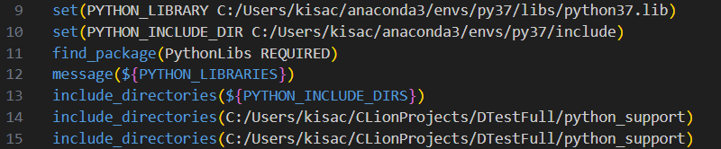
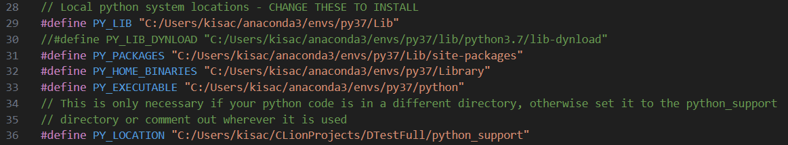
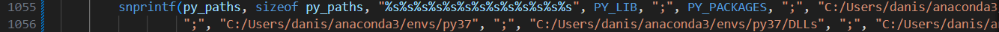
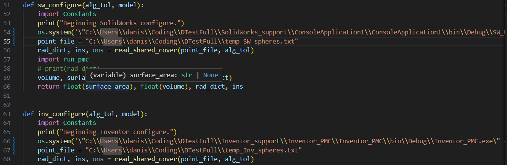
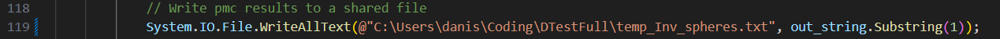
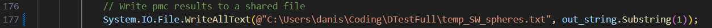
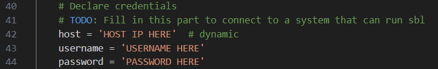
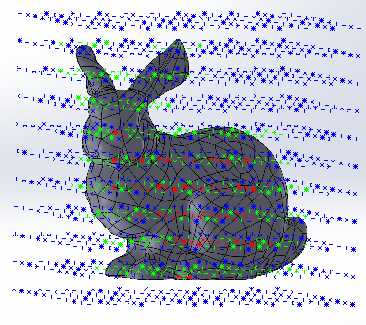
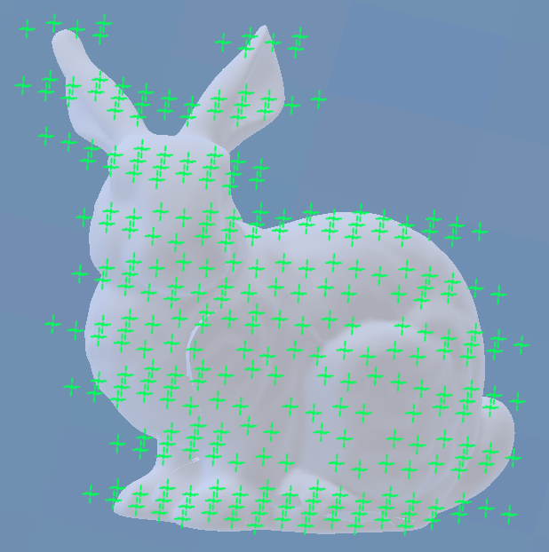

# DTestFull

## Installation
### Required Packages:

pip packages: numpy, scipy, sympy, argparse, sortedcontainers

Conda packages: pythonocc (https://github.com/tpaviot/pythonocc-core)

External Libraries: Structural Bioinformatics Library (https://sbl.inria.fr/)

### To install:

1. Checkout from git
2. Create virtual Conda environment:
  
   - `conda create --name py37 python=3.7`
   - `conda activate py37`
  
3. Install required python packages into Conda environment

   - `pip install numpy scipy sympy argparse sortedcontainers`
   <!-- - `conda install -c dlr-sc pythonocc-core=7.4.0`  -->

4. Get pythonocc-core via the following conda installer:

   - `conda install conda-forge::pythonocc-core=7.4.0` 
   
5. Change paths in CMakeLists.txt and DTest.c to your venv's python installation

   - You will need to link to the Python library and executables, as well as adding these directories to the search path.
   - In CMakeLists.txt:<br>
   
   - In DTest.c:
   
   - In DTest.c:
   
   - Add the location of python37.dll (in anaconda3/envs/py37) to your system path. You may need to restart your shell afterwards for the changes to take effect!
   - If it still fails to load required DLLs after running import gp, you may need to copy them manually from {\$conda_root}/envs/py37/Library/bin into {\$conda_root}/envs/py37/Lib/site-packages/OCC/Core.

6. On Windows, POSIX compatible C compiler is needed. One such compiler is MinGW on MSYS2.

7. For Solidworks and Inventor compatibility you will also need a installation of these two, and compile the executables corresponding to each. 
They are stored as Visual Studio solutions in Inventor_PMC and Solidworks_PMC, and also contain hardcoded paths that will need to be updated. First, there is one in py_interface.py:

Then there is one for Inventor in Program.cs:

And one for SolidWorks in Console_PMC.cs:

The filename here is where the PMQ output is stored, and should match the names in py_interface.py.
Certain aspects of this code have not been optimized yet, for example there are recently introduced policies on how to link Python to C, or ways to streamline the connection to Solidworks and Inventor.

1. To install SBL, a UNIX OS is currently required. This makes installation on Windows difficult, but can be worked around either by setting up a remote connection to a UNIX compatible machine, or setting up a local VM that can run SBL. In either case, changes will need to be made to pmc.volume to be able to access whatever sbl installation you use. For the ssh solution, enter the details in the volume method of python_support/pmc.py:
   


### Usage

Once installed, we need simply need to run DTest.exe. 

Usage:
`./DTest <System1> <System2> <Model1> <Model2> <TestName> <Cover Parameter> <Algorithm Precision>`

For systems, use Rhino = 0, OpenCascade = 1, OpenSCAD = 2, MeshLab = 3, SolidWorks = 4, Inventor = 5 (Rhino, OpenSCAD and MeshLab are WIPs for Windows), and algorithm precision should be in mm. 

The cover parameter is allowed to be entered manually, but a first run with whatever cover parameter will give a suggestion as to what cover parameter to use for the model.

## Bunny Walkthrough with Visualization

In this section, we walk through how one can use DTest to evaluate the interoperability of Solidworks and Inventor using the Stanford bunny as the test model. 

The Bunny model was originally a mesh. We imported a version where it is treated as a smooth solid, and saved it to data/bunny.ipt. We then transferred the model to SolidWorks as data/bunny.SLDPRT. To measure the success of the transfer, we utilize DTest to construct the point clouds, and run the following command: 

./DTest 4 5 C:/Users/danis/Coding/DTestfull/data/bunny.SLDPRT C:/Users/danis/Coding/DTestfull/data/bunny.ipt bunny_test 7.2 10 

where the numbers 4 and 5 define the systems to be used, and are followed by the two filenames, the name of the test, the algorithm tolerance for the PMC queries, and the tolerance used to determine whether two models are interoperable. 

The execution of this command saves the point files as temp_SW_spheres.txt and temp_Inv_spheres.txt, with the points separated by ~ and pmc result by $, with -1 for out, 0 for on, 1 for in. If you have SBL connection set up, it outputs the results to the bunny_test file. The following was output for the experiment on the above files:

```
Running test bunny_test on model 1 C:/Users/danis/Coding/DTestfull/data/bunny.SLDPRT and model 2 C:/Users/danis/Coding/DTestfull/data/bunny.ipt with tolerance 10.00000:

Volume:
Systems SolidWorks and Inventor have compatible volumes with a spatially-scaled accuracy of 5.059 mm.

Surface Area:
Systems SolidWorks and Inventor have incompatible areas with a spatially-scaled accuracy of 17.81 mm.

Hausdorff Distance:
Systems SolidWorks and Inventor have a compatible Hausdorff Distance of 8.09170285417822
```

The computed point clouds can then even be visualized in Solidworks and Inventor. In Solidworks, we have included a display_points_macro, which, once the appropriate point cloud filename is defined within the code, displays the points as a sketch within the given solidworks file. For the bunny, this would create a point cloud like the one below:




In inventor this code is included as a C\# application. The file DisplayCloud.cs includes code to, once a filename is set, add the points to the model in Autodesk Inventor. The user can specify which points they want to add, as well as whether they want to add small spheres or sketch points. Below is an example of what the output might look like for the Stanford Bunny, with only the ON points showing:



## References

https://arxiv.org/abs/2001.10585

https://doi.org/10.1016/j.cad.2019.05.004
