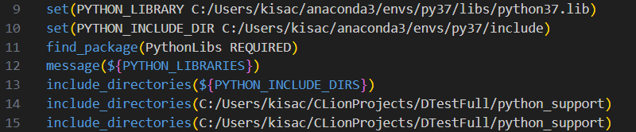
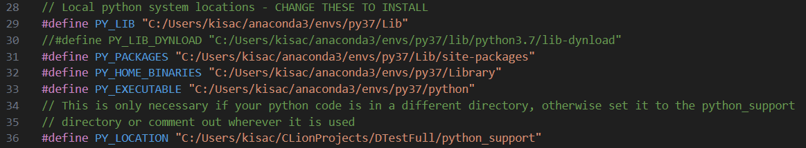
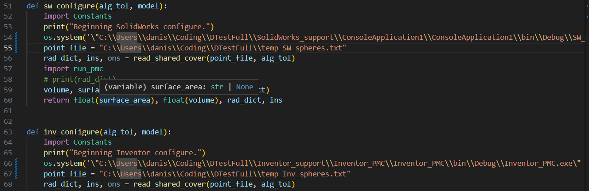
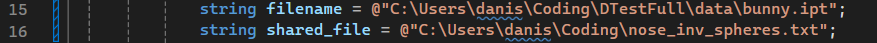
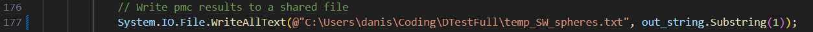
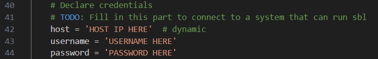

# DTestFull

## Installation
### Required Packages:

pip packages: numpy, scipy, sympy, xml, argparse, multiprocessing

Conda packages: pythonocc (https://github.com/tpaviot/pythonocc-core)

External Libraries: Structural Bioinformatics Library (https://sbl.inria.fr/)

### To install:

1. Checkout from git
2. Create virtual Conda environment:
  
   - `conda create --name py37 python=3.7`
   - `conda activate py37`
  
3. Install required packages into Conda environment

   - `pip install numpy scipy sympy argparse`
   - `conda install -c dlr-sc pythonocc-core=7.4.0` (Only used for opencascade integration, which can be avoided if your system is unable to install occ)
   
4. Change paths in CMakeLists.txt and DTest.c to your venv's python installation

   - You will need to link to the Python library and executables, as well as adding these directories to the search path.
   - In CMakeLists.txt:
   
   - In DTest.c:
   
   - Add the location of python37.dll (in anaconda3/envs/py37) to your system path. You may need to restart your shell afterwards for the changes to take effect!

5. On Windows, POSIX compatible C compiler is needed. One such compiler is MinGW on MSYS2. Different compilers will come with different challenges, depending also on the development environment you are trying to run in.

6. For Solidworks and Inventor compatibility you will also need a valid installation of these two, and compile the executables corresponding to each. They are stored as Visual Studio solutions in Inventor_PMC and Solidworks_PMC, and also contain hardcoded paths that will need to be updated. First, there is one in py_interface.py:

Then there is one for Inventor in DisplayCloud.cs:

And only one for SolidWorks in Console_PMC.cs:

If you have gotten this far, I should mention the code is not optimized, it is only a proof of concept with features added slowly over the course of years. Many things are hardcoded that shouldn't be, some processes could be streamlined, and installation is arduous and not end-user friendly. If you would like to assist in development, please contact the authors.

1. To install SBL, a UNIX OS is currently required. This makes installation on Windows difficult, but can be worked around either by setting up a remote connection to a UNIX compatible machine, or setting up a local VM that can run SBL. In either case, changes will need to be made to pmc.volume to be able to access whatever sbl installation you use. For the ssh solution, enter the details in the volume method of python_support/pmc.py:
   

## References

https://arxiv.org/abs/2001.10585

https://doi.org/10.1016/j.cad.2019.05.004
